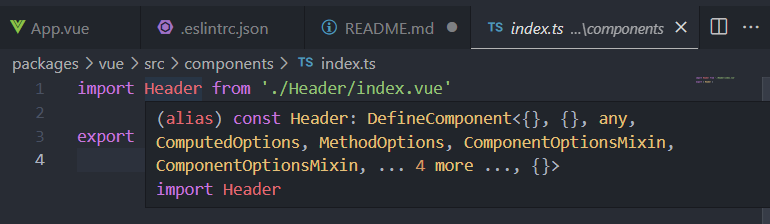
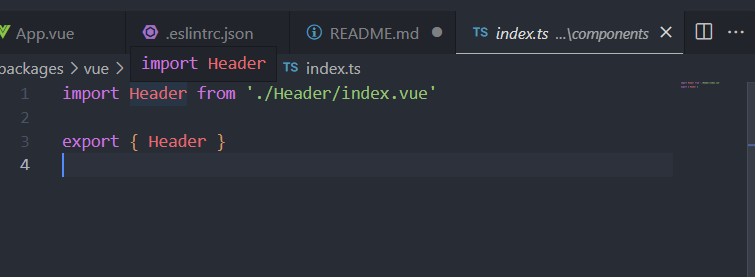

### Recommendation

use [_Volar Takeover Mode_](https://vuejs.org/guide/typescript/overview.html#configuring-tsconfig-json) for better dx. For example like _better component file navigation_

- without volar takeover mode, it would lead you to the global vue component declaration

  

- with volar takeover mode, it would lead you to the correct component file

  
